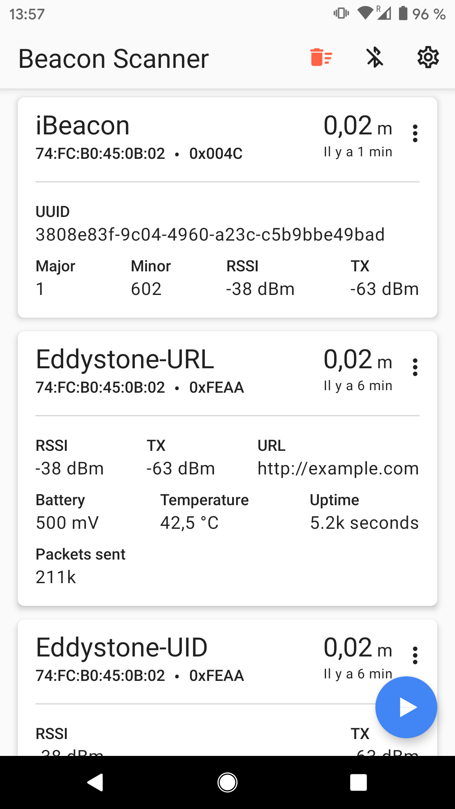
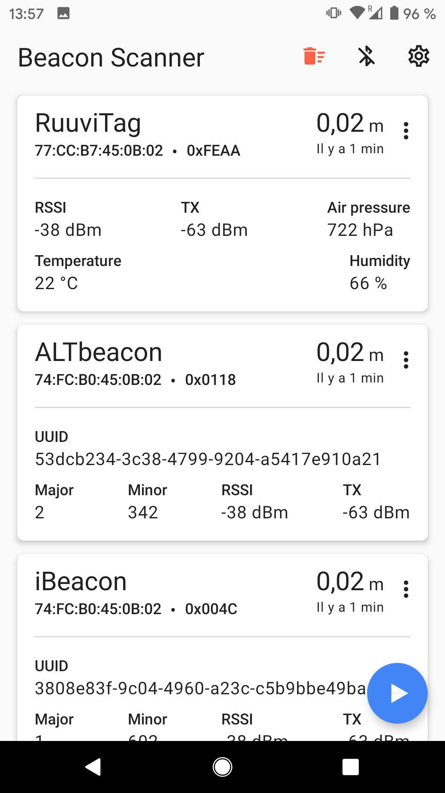
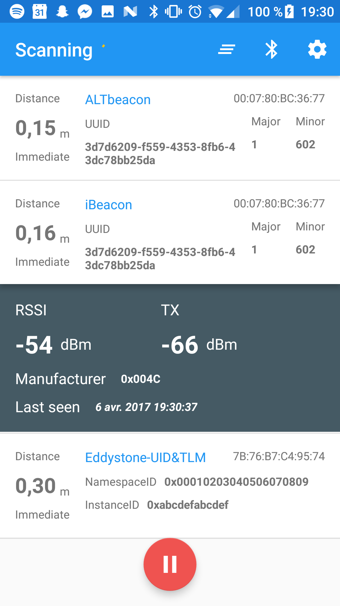

# :cyclone: Android Beacon Scanner #

A simple android beacon scanner that can recognize iBeacons, AltBeacons, Eddystone beacons (UID and URL, with or without TLM) and RuuviTags [available on Google Play](https://play.google.com/store/apps/details?id=com.bridou_n.beaconscanner).

        

Available for android 4.3+ and smartphones with Bluetooth LE.

## :key: Features ##

This app will scan for beacons near you! :v:

For all Beacons:
* The type of beacon (iBeacon, AltBeacon, Eddystone or RuuviTag)
* The approximation of the distance with the beacon (this is based on the RSSI value received and is NOT accurate)
* The beacon address and manufacturer code
* The RSSI and TX values
* The last time the beacon has been seen

For iBeacons and AltBeacons:
* UUID
* Major
* Minor

For Eddystone-UID beacons:
* NamespaceID
* InstanceID
* TLM data sent if any

For Eddystone-URL and RuuviTag
* Clickable URL
* TLM data sent if any

For RuuviTag:
* Air Pressure
* Temperature
* Humidity

It can display several frames emitted by a single beacon, allowing you to see if a beacon emits multiple frames types (for example radius network beacons can emit iBeacon and AltBeacon at the same time)!

* You can also log the scans of the beacons to an endpoint via a HTTP POST request.

## :blue_book: Main libraries used ##

 - [AltBeacon](https://github.com/AltBeacon/android-beacon-library)
	 - Scanning for beacons nearby
	 - Making the difference between iBeacons, AltBeacons and Eddystone beacons
	 - Easily getting data emitted by the beacons (UUID, major, minor, namespaceID...)
 - [Realm & Realm adapters](https://github.com/realm/realm-java)
	 - Storing and retrieving data on the phone
 - [Retrofit](http://square.github.io/retrofit/)
	 - Network calls for POSTing to an endpoint
 - [RxJava (& RxAndroid)](https://github.com/ReactiveX/RxJava)
	 - Easily threading and network calls abstraction
 - [Dagger 2](https://google.github.io/dagger/)
	 - Inject dependencies such as Realm, BeaconManager, API services, Preferences into the app
 - [ButterKnife](https://github.com/JakeWharton/butterknife)
	 - Bind Android views to fields.
 - [TapTargetView](https://github.com/KeepSafe/TapTargetView)
	- Material design discovery feature made easy

## License ##

	Licensed under the Apache License, Version 2.0 (the "License");
    you may not use this file except in compliance with the License.
    You may obtain a copy of the License at

        http://www.apache.org/licenses/LICENSE-2.0

    Unless required by applicable law or agreed to in writing, software
    distributed under the License is distributed on an "AS IS" BASIS,
    WITHOUT WARRANTIES OR CONDITIONS OF ANY KIND, either express or implied.
    See the License for the specific language governing permissions and
    limitations under the License.

This software is available under the Apache License 2.0
